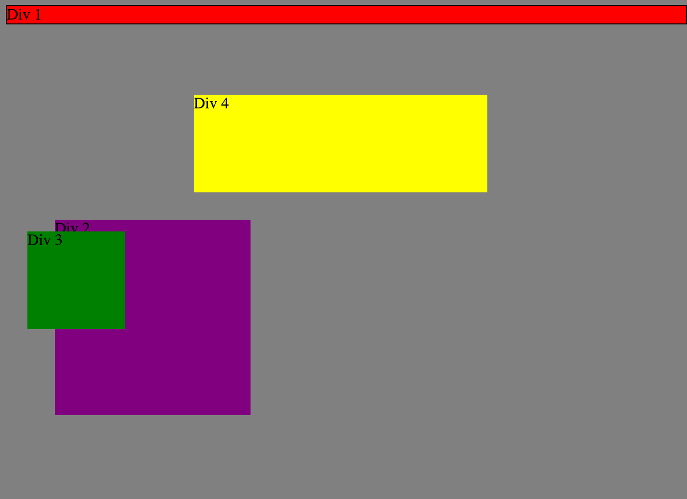
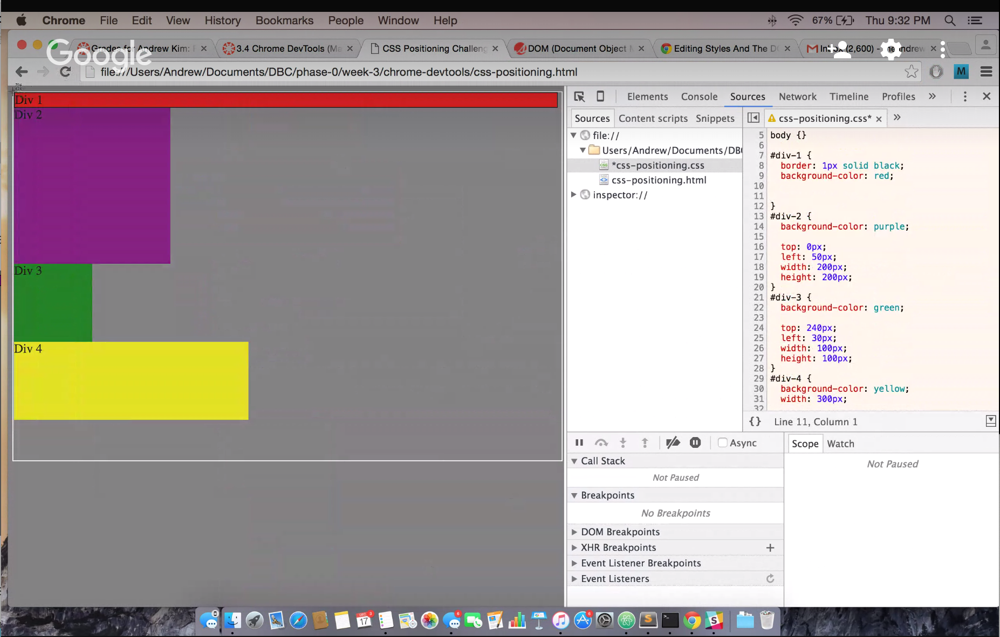
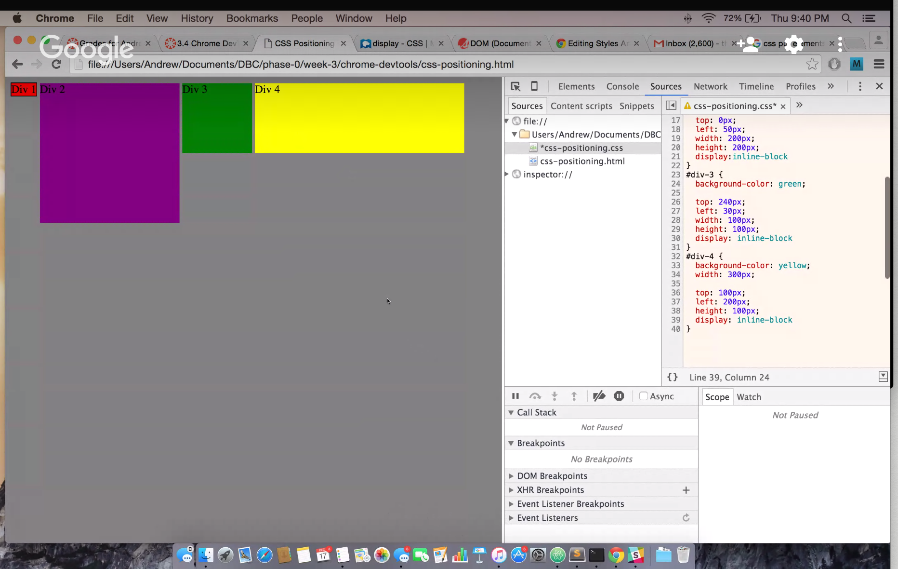
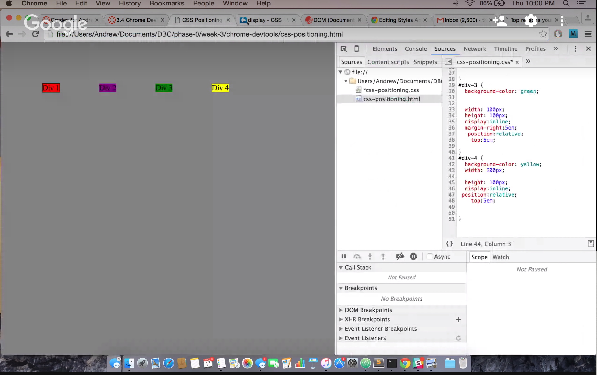
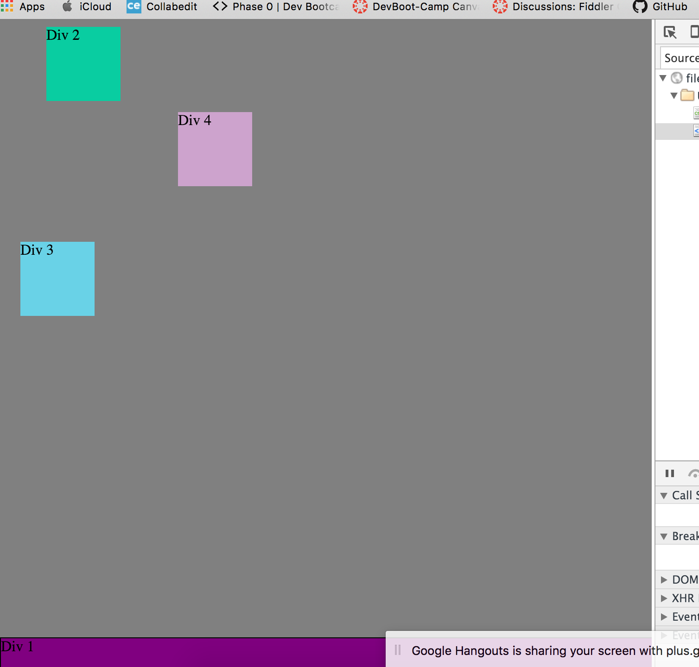
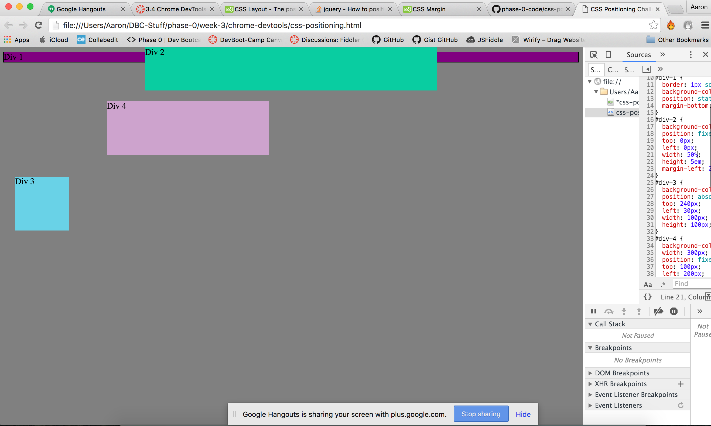
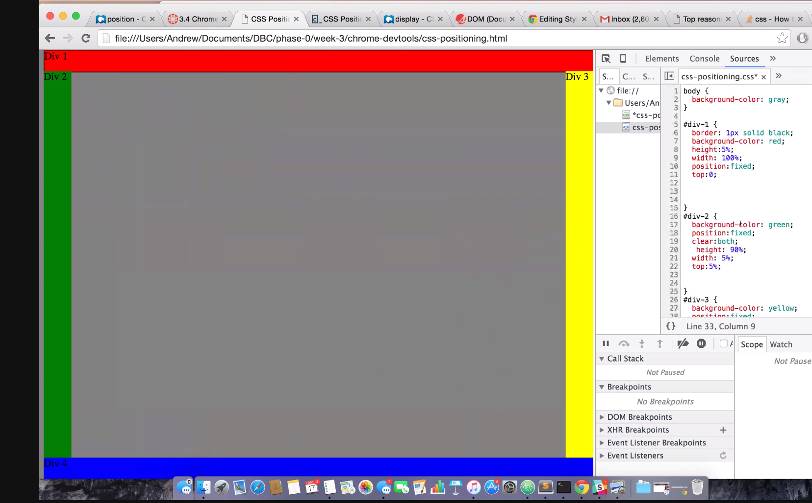

##How can you use Chrome's DevTools inspector to help you format or position elements?

Chrome's DevTools is really good for formatting and position because it display the CSS adjustment inreal time.  Therefor we do not have to keep saving and refreshing our page to see the changes.  Once we are satisfied with our changes in CSS we can just copy and paste the CSS into our .css file.  I have done CSS already and moved on to 3.7 in adding CSS to my index.html file but I was saving and reloading the page.  Which I had to do a few dozen time.  This does make things a lot eazier to work on CSS.

##How can you resize elements on the DOM using CSS?

In 3.4 we resize by doing a px (pixel) count, em count (font size of the element), or by percentage %.

There are a few other resizing elements.  Pixel is an absolute size and the 'em' is an relative length.

If we were to change the text 'Change this'.  The DOM tree is html>body>p.

##What are the differences between absolute, fixed, static, and relative positioning? Which did you find easiest to use? Which was most difficult?

Static:  By default it lay itself according to the normal flow of the page.  You can't add top, bottom, right nor left to it.

Relative:  By default it also acts like static by putting itself on the page according.  However, you can adjust the top, bottom, right and left from its original position.

Fixed: It will stay on the page even if the user scrolls up or down.  It will not change the position of the fixed item. It will also lay itself on top of any object on the screen.

Absolute: Will position itself to the nearest anchor, however if it has no nearest anchor it will position itself to the body of the document.  It could also move along the html unlike the fixed.

##What are the differences between margin, border, and padding?

To explain the margin, border, and padding I want to you refer to the image I have linked on this page.

The content is what's inside, then the next layer is padding, and next layer is boarder, and last is margin.  You have to think of it as an onion.  Which layer you want to adjust.
As a key keeping the concept of content > padding > boarder > margin is my way of thinking of it.

##What was your impression of this challenge overall? (love, hate, and why?)

I LOOOOOOVE and hate it.  The position is very confusing but I try to play with the position more and more it gets easier as I go.  Each one has its purpose and knowing when to use what is very important.  But learning how to use chrome devtool is huge.

