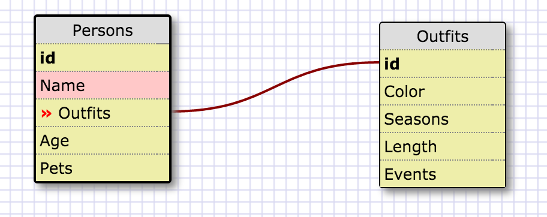
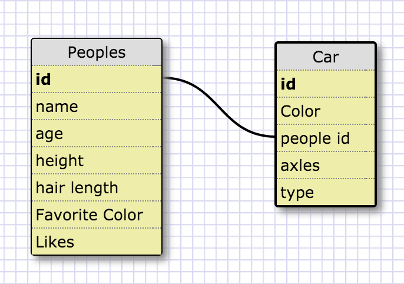

#Reflection

##What are databases for?

Database are a great way and have a list of itmes that belong with their KeyVales.  For example if we made a grocery list.  We can make a list from list of items we need, then another colums which isle its located in, a column by cost.  Then we can sort it either by isle and split the list in half so we can speed up our grocery time by half.  Or see the list by price and see if it might be too much money.  Or make you could make two separte tables to compare cost for each store.

##What is a one-to-many relationship?

One to many is more like a seprate list of items that you wouldn't want to put in the primary table.  It helps keeps the main table free of clutter.  Also acts more like a 2nd list to is related to the primary list.  If we are descibing or listing out what pets did you ever had.  That information isn't relevant to describing each person.  Pets are more like a 2nd discription of that person.  So we can put that on a 2nd list known as an one-to-many list.  That relationship to the main list is know as a one-to-many relationshiop.

##What is a primary key? What is a foreign key? How can you determine which is which?

Primary key is a key or name which we can call each roll that is different from any other roll on the table.  Primary keys can't be used more than once.
A foreign key is used to link the relationship between the primary key to the 2nd list.  In the 2nd list the foreign key could be used more than once.  Thats how you can idenitfy which is the primary key and which is the foregin key.

##How can you select information out of a SQL database? What are some general guidelines for that?

To select information from SQL, you must use the command "SELECT" and "FROM" to select from a database.  SELECT calls for the roll name and FROM select from the table you're selecting from.  The 3rd item is if you are looking for conditions which will make things sorting out easier.

##One to One

##One to Many

RELEASE 5:
1.
SELECT * FROM states;

2.
SELECT * FROM regions;

3.
SELECT state_name, populaton
FROM states;

4.
SELECT state_name, population
FROM states
ORDER BY population DESC;

5.
SELECT state_name
FROM states
WHERE region = 7;

6.
SELECT state_name, population_density
FROM states
WHERE population_density > 50;

7.
SELECT state_name
FROM states
WHERE population BETWEEN 1000000 AND 1500000;

8.
SELECT state_name, region_id
FROM states
ORDER BY region_id ASC;

9.
SELECT region_name
FROM regions
WHERE region_name = '%central%';

10.
SELECT region_name, state_name
FROM regions, states
ORDER BY region_id ASC;
