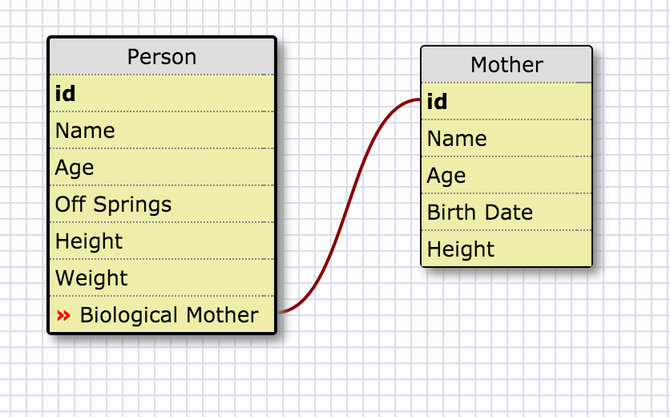
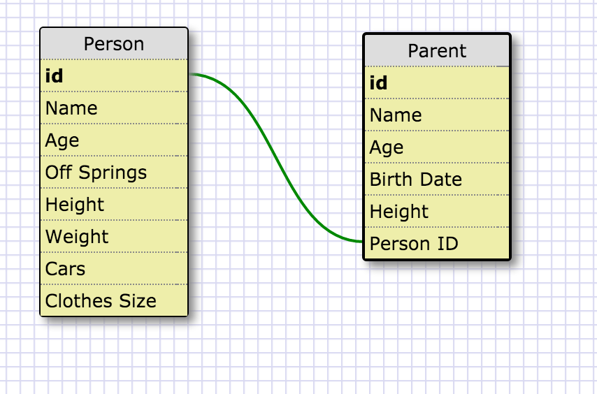
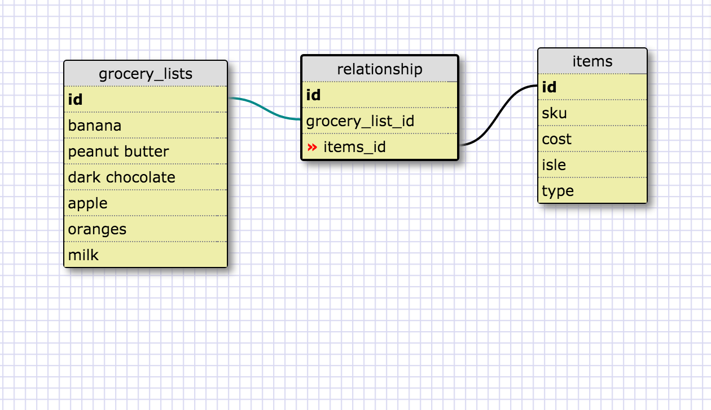

##One to One
One to one is a relation because one person can have only one biolocial mother.

##One to Many
One to many relation is because one person can have more than one parents.

##Many to Many
Many to Many relation is because there could could me more items on our shopping list and it relation to itmes is their cost, sku, isle number, etc.

#Reflection

##What is a one-to-one database?
One to one is mostly used in data base as an extension of the first one.  It's to make the primary list cleaner and faster to load because there's info that doesn't need to be loaded unless we wanted to look into more details.  On the example above if we just wanted to know about a person we can.  If we wanted to know more of their mother we can then drill down into another table to be able to see her info.

##When would you use a one-to-one database? (Think generally, not in terms of the example you created).

We would use it to make finding things faster for the computer.  Because of the cleaner list and its shorter.  We can find information faster.

##What is a many-to-many database?

Many to many data base is a large collection of data coming with another large colletion of data into one list.

##When would you use a many-to-many database? (Think generally, not in terms of the example you created).

Many to many are used everywhere.  Such as a grocery store for invoices, receiving, instock itmems, and etc.  They would all come together and be a central list to index all these things and where they are connected together.

##What is confusing about database schemas? What makes sense?

I see why we need to have different types of database.  I think I need to see and work with more to understand it more.  The one to one and one to many made a alot of sense to me.  I do need to practice more on many to many and many to more to get a full understandingof it.